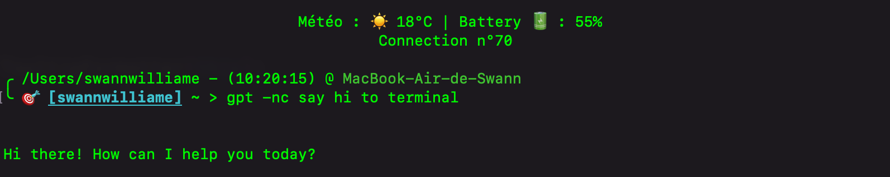

# <p align="center"> GPT Cli</p>



**gpt_cli** is a useful yet powerful tool developped in Python that adds Chat-GPT and other OpenAI tools directly to your terminal !

 
### Current tools :
* **Command generator** : Simply explain in the terminal what you want to do and Chat-GPT will generate the command and execute it ! => No more code needed :)

* **Ask GPT** : Just want to ask a question to Chat-GPT you can do it easily here and choose between GPT 3.5-turbo or GPT 4o

* **Generate Image** : You can quickly generate an image from your shell 

* **Transform text to speech** : Easily transform your text to a speech by using command ```gptc -a <prompt>```

To get every possible commands, simply use ```gptc -h```
